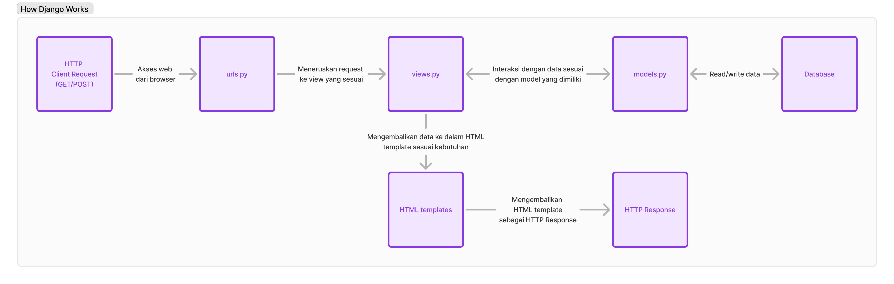

# Tugas 2: Implementasi *Model-View-Template* (MVT) pada Django
##### Nabeel Muhammad (2306275166)
Web : http://nabeel-muhammad-sportifyfinal.pbp.cs.ui.ac.id/
- Jelaskan bagaimana cara kamu mengimplementasikan checklist di atas secara step-by-step (bukan hanya sekadar mengikuti tutorial).
    - Membuat sebuah proyek Django baru.
        1. Membuat folder baru dengan nama `sportify`.
        2. Membuat virtual environment dengan menjalankan `python -m venv env` pada terminal dengan directory `sportify`.
        3. Membuat file dengan nama `requirements.txt` yang berisikan depedencies yang dibutuhkan untuk membuat project Django
            ```
            django
            gunicorn
            whitenoise
            psycopg2-binary
            requests
            urllib3
            ```
        4. Mengaktifkan virtual environment dengan menjalankan `env/Scripts/activate` pada terminal dengan directory `sportify`.
        5. Melakukan instalasi depedencies dengan menjalankan `pip install -r requirements.txt` pada terminal.
        6. Membuat project Django dengan menjalankan `django-admin startproject sportify .` pada terminal.
    -  Membuat aplikasi dengan nama main pada proyek.tersebut.
        1. Menjalankan ```python manage.py startapp main``` pada terminal.
    - Melakukan routing pada proyek agar dapat menjalankan aplikasi main. Membuat sebuah fungsi pada `views.py` untuk dikembalikan ke dalam sebuah template HTML yang menampilkan nama aplikasi serta nama dan kelas kamu. Membuat sebuah routing pada `urls.py` aplikasi main untuk memetakan fungsi yang telah dibuat pada `views.py`.
        1. Membuat folder `templates` pada folder `main` yang nantinya akan digunakan untuk menyimpan file HTML untuk setiap page yang dibutuhkan.
        2. Membuat file dengan nama `main.html` yang berguna untuk menyimpan tampilan halaman utama untuk *main app*
        3. Mengisi file `views.py` pada folder `main` dengan fungsi yang menerima parameter *request* dan berguna untuk me-*render* `main.html` serta menyertakan *context* yang nantinya akan berupa data dari *database* yang kita inginkan. Dalam Tugas 2 ini saya hanya menggunakan *code* di bawah ini.
            ```
            from django.shortcuts import render

            def show_main(request):
                context = {
                    'app_name' : 'Sportify',
                    'name': 'Nabeel Muhammad',
                    'class': 'PBP A'
                }

                return render(request, "main.html", context)
            ```
        4. Membuat file `urls.py` yang berisikan *code* dibawah ini.
            ```
            from django.urls import path
            from main.views import show_main

            app_name = 'main'

            urlpatterns = [
                path('', show_main, name='show_main'),
            ]
            ```
            *Code* di atas berguna untuk membuat url yang nantinya akan dideteksi oleh Django sebagai `main.urls` untuk menghubungkan *main app* dengan project *Sportify* 
        5. Menambahkan *code* di bawah ini pada file `urls.py` yang berada di dalam folder `sportify` 
            ```
            from django.urls import include
            ....
            urlpatterns = [
                ....
                path('', include("main.urls")),
                ....
            ]
            ```
        6. Menambahkan `main` pada `INSTALLED_APPS` yang berada pada file `settings.py` dalam folder `sportify` 
            ```
            INSTALLED_APPS = [
                ....,
                'main'
            ]
            ```
    - Membuat model pada aplikasi `main` dengan nama `Product` dan memiliki atribut wajib sebagai berikut.
        - `name`
        - `price`
        - `description`
        1. Mengubah isi pada file `models.py` yang berada pada folder `main` dengan class sesuai yang diinginkan. Dalam Tugas 2 ini kita membuat class `Product` dengan *code* di bawah ini.
            ```
            from django.db import models

            class Product(models.Model):
                name = models.CharField(max_length=255)
                price = models.IntegerField()
                description = models.TextField()
                stock = models.IntegerField()
            ```
            Saya menambahkan atribut `stock` yang nantinya akan menjadi atribut untuk setiap object `Product`.
        2. Menjalankan `python manage.py makemigrations` pada terminal untuk mempersiapkan migrasi skema model ke dalam database Django lokal
        3. Menjalankan `python manage.py migrate` pada terminal untuk menerapkan skema model yang telah dibuat ke dalam database Django lokal.
<br/>

- Buatlah bagan yang berisi *request client* ke web aplikasi berbasis Django beserta responnya dan jelaskan pada bagan tersebut kaitan antara `urls.py`, `views.py`, `models.py`, dan berkas html.
    
    - `urls.py` : berguna untuk menentukan views yang sesuai dengan request yang diberikan.
    - `views.py` : berguna untuk berinteraksi dengan `models.py` lalu menjalankan logika yang diinginkan.
    - `models.py` : berguna untuk memodelkan data yang ingin disimpan pada database serta digunakan pada HTML melalui `views.py`.
    - `HTML` : berguna untuk menampilkan data sesuai tampilan yang diinginkan.

- Jelaskan fungsi git dalam pengembangan perangkat lunak!
    1. Sebagai penyimpanan *source code* dari project yang ingin kita buat.
    2. Memudahkan kolaborasi karena kita dapat melakukan *pull request* yang membuat *source code* dapat dikerjakan sesuai bagian yang telah dibagikan.
    3. Sebagai *version control* karena mempunyai sistem *commit* yang dapat kita lihat sebagai *control* terhadap perubahan *file* yang dilakukan.
<br/>

- Menurut Anda, dari semua framework yang ada, mengapa framework Django dijadikan permulaan pembelajaran pengembangan perangkat lunak?
    1. **Kemudahan Penggunaan dan Konvensi**: Django didesain dengan prinsip "*batteries included*" yang berarti banyak fitur penting, seperti otentikasi, manajemen database, dan routing, sudah disediakan langsung tanpa perlu konfigurasi tambahan. Ini memudahkan pemula untuk fokus pada logika aplikasi daripada harus membangun semuanya dari nol.
    2. **Dokumentasi Lengkap**: Django dikenal dengan dokumentasinya yang sangat lengkap dan ramah bagi pemula. Dokumentasi yang jelas membantu pengguna baru memahami konsep-konsep dasar *framework* tanpa terlalu banyak kebingungan.
    3. **Community Support**: Django memiliki komunitas yang besar dan aktif, sehingga jika pemula menghadapi masalah, mereka bisa dengan mudah menemukan solusi melalui forum, blog, atau Stack Overflow.
<br/>

- Mengapa model pada Django disebut sebagai ORM?
    Karena Django menggunakan objek dalam Python untuk melakukan interaksi dengan *database*. Object Relational Mapper (ORM) pada Django merupakan *library code* yang berguna untuk otomatisasi *data transfer* yang disimpan pada *relational database tables* menjadi objek yang mudah diimplementasi dalam Python.