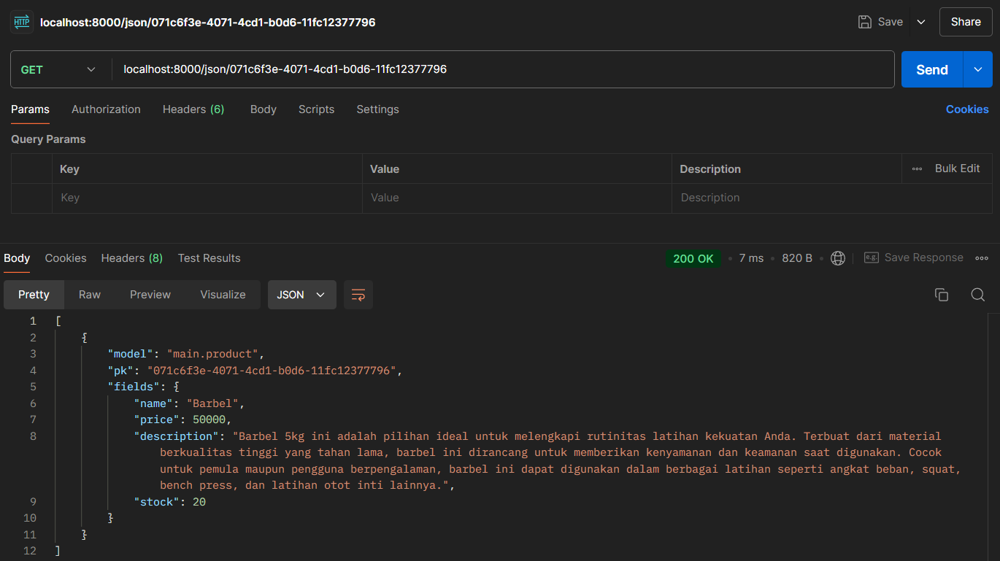

##### Nabeel Muhammad (2306275166)
Web : http://nabeel-muhammad-sportify.pbp.cs.ui.ac.id/
# Tugas 2: Implementasi *Model-View-Template* (MVT) pada Django
- Jelaskan bagaimana cara kamu mengimplementasikan checklist di atas secara step-by-step (bukan hanya sekadar mengikuti tutorial).
    - Membuat sebuah proyek Django baru.
        1. Membuat folder baru dengan nama `sportify`.
        2. Membuat virtual environment dengan menjalankan `python -m venv env` pada terminal dengan directory `sportify`.
        3. Membuat file dengan nama `requirements.txt` yang berisikan depedencies yang dibutuhkan untuk membuat project Django
            ```
            django
            gunicorn
            whitenoise
            psycopg2-binary
            requests
            urllib3
            ```
        4. Mengaktifkan virtual environment dengan menjalankan `env/Scripts/activate` pada terminal dengan directory `sportify`.
        5. Melakukan instalasi depedencies dengan menjalankan `pip install -r requirements.txt` pada terminal.
        6. Membuat project Django dengan menjalankan `django-admin startproject sportify .` pada terminal.
    -  Membuat aplikasi dengan nama main pada proyek.tersebut.
        1. Menjalankan ```python manage.py startapp main``` pada terminal.
    - Melakukan routing pada proyek agar dapat menjalankan aplikasi main. Membuat sebuah fungsi pada `views.py` untuk dikembalikan ke dalam sebuah template HTML yang menampilkan nama aplikasi serta nama dan kelas kamu. Membuat sebuah routing pada `urls.py` aplikasi main untuk memetakan fungsi yang telah dibuat pada `views.py`.
        1. Membuat folder `templates` pada folder `main` yang nantinya akan digunakan untuk menyimpan file HTML untuk setiap page yang dibutuhkan.
        2. Membuat file dengan nama `main.html` yang berguna untuk menyimpan tampilan halaman utama untuk *main app*
        3. Mengisi file `views.py` pada folder `main` dengan fungsi yang menerima parameter *request* dan berguna untuk me-*render* `main.html` serta menyertakan *context* yang nantinya akan berupa data dari *database* yang kita inginkan. Dalam Tugas 2 ini saya hanya menggunakan *code* di bawah ini.
            ```
            from django.shortcuts import render

            def show_main(request):
                context = {
                    'app_name' : 'Sportify',
                    'name': 'Nabeel Muhammad',
                    'class': 'PBP A'
                }

                return render(request, "main.html", context)
            ```
        4. Membuat file `urls.py` yang berisikan *code* dibawah ini.
            ```
            from django.urls import path
            from main.views import show_main

            app_name = 'main'

            urlpatterns = [
                path('', show_main, name='show_main'),
            ]
            ```
            *Code* di atas berguna untuk membuat url yang nantinya akan dideteksi oleh Django sebagai `main.urls` untuk menghubungkan *main app* dengan project *Sportify* 
        5. Menambahkan *code* di bawah ini pada file `urls.py` yang berada di dalam folder `sportify` 
            ```
            from django.urls import include
            ....
            urlpatterns = [
                ....
                path('', include("main.urls")),
                ....
            ]
            ```
        6. Menambahkan `main` pada `INSTALLED_APPS` yang berada pada file `settings.py` dalam folder `sportify` 
            ```
            INSTALLED_APPS = [
                ....,
                'main'
            ]
            ```
    - Membuat model pada aplikasi `main` dengan nama `Product` dan memiliki atribut wajib sebagai berikut.
        - `name`
        - `price`
        - `description`
        1. Mengubah isi pada file `models.py` yang berada pada folder `main` dengan class sesuai yang diinginkan. Dalam Tugas 2 ini kita membuat class `Product` dengan *code* di bawah ini.
            ```
            from django.db import models

            class Product(models.Model):
                name = models.CharField(max_length=255)
                price = models.IntegerField()
                description = models.TextField()
                stock = models.IntegerField()
            ```
            Saya menambahkan atribut `stock` yang nantinya akan menjadi atribut untuk setiap object `Product`.
        2. Menjalankan `python manage.py makemigrations` pada terminal untuk mempersiapkan migrasi skema model ke dalam database Django lokal
        3. Menjalankan `python manage.py migrate` pada terminal untuk menerapkan skema model yang telah dibuat ke dalam database Django lokal.
<br/>

- Buatlah bagan yang berisi *request client* ke web aplikasi berbasis Django beserta responnya dan jelaskan pada bagan tersebut kaitan antara `urls.py`, `views.py`, `models.py`, dan berkas html.
    
    - `urls.py` : berguna untuk menentukan views yang sesuai dengan request yang diberikan.
    - `views.py` : berguna untuk berinteraksi dengan `models.py` lalu menjalankan logika yang diinginkan.
    - `models.py` : berguna untuk memodelkan data yang ingin disimpan pada database serta digunakan pada HTML melalui `views.py`.
    - `HTML` : berguna untuk menampilkan data sesuai tampilan yang diinginkan.

- Jelaskan fungsi git dalam pengembangan perangkat lunak!
    1. Sebagai penyimpanan *source code* dari project yang ingin kita buat.
    2. Memudahkan kolaborasi karena kita dapat melakukan *pull request* yang membuat *source code* dapat dikerjakan sesuai bagian yang telah dibagikan.
    3. Sebagai *version control* karena mempunyai sistem *commit* yang dapat kita lihat sebagai *control* terhadap perubahan *file* yang dilakukan.
<br/>

- Menurut Anda, dari semua framework yang ada, mengapa framework Django dijadikan permulaan pembelajaran pengembangan perangkat lunak?
    1. **Kemudahan Penggunaan dan Konvensi**: Django didesain dengan prinsip "*batteries included*" yang berarti banyak fitur penting, seperti otentikasi, manajemen database, dan routing, sudah disediakan langsung tanpa perlu konfigurasi tambahan. Ini memudahkan pemula untuk fokus pada logika aplikasi daripada harus membangun semuanya dari nol.
    2. **Dokumentasi Lengkap**: Django dikenal dengan dokumentasinya yang sangat lengkap dan ramah bagi pemula. Dokumentasi yang jelas membantu pengguna baru memahami konsep-konsep dasar *framework* tanpa terlalu banyak kebingungan.
    3. **Community Support**: Django memiliki komunitas yang besar dan aktif, sehingga jika pemula menghadapi masalah, mereka bisa dengan mudah menemukan solusi melalui forum, blog, atau Stack Overflow.
<br/>

- Mengapa model pada Django disebut sebagai ORM?
    Karena Django menggunakan objek dalam Python untuk melakukan interaksi dengan *database*. Object Relational Mapper (ORM) pada Django merupakan *library code* yang berguna untuk otomatisasi *data transfer* yang disimpan pada *relational database tables* menjadi objek yang mudah diimplementasi dalam Python.
___

# Tugas 3: Implementasi Form dan Data Delivery pada Django

- **Jelaskan mengapa kita memerlukan data delivery dalam pengimplementasian sebuah platform?**
    1. **Berguna untuk pertukaran data antar komponen dalam platform:**  Setiap platform pastinya terdiri dari berbagai modul atau layanan yang saling berhubungan. *Data delivery* memungkinkan adanya pertukaran informasi atau data antar layanan sehingga platform dapat berfungsi secara optimal.
    2. **Interaksi Pengguna:** Sebuah platform seringkali bergantung pada interaksi pengguna, seperti saat pengguna mengirimkan permintaan, formulir, atau data lainnya. Data delivery memastikan bahwa data yang dimasukkan oleh pengguna dapat sampai ke sistem dengan aman dan cepat untuk diolah dan dikembalikan dalam bentuk tanggapan atau layanan.
    3. **Ketersediaan dan Konsistensi Data Real-Time:** Banyak platform modern, terutama yang berbasis web atau cloud, memerlukan pengiriman data secara real-time. Misalnya, dalam aplikasi e-commerce, data tentang ketersediaan produk, harga, dan pembaruan stok harus dikirimkan ke pengguna secara tepat waktu untuk menjaga konsistensi informasi.
    4. **Skalabilitas Platform:** Ketika platform berkembang dan harus melayani lebih banyak pengguna atau data, sistem pengiriman data harus mampu menangani peningkatan volume tersebut. Sistem data delivery yang skalabel memastikan bahwa platform dapat melayani pengguna dalam jumlah besar tanpa penurunan performa.
- **Menurutmu, mana yang lebih baik antara XML dan JSON? Mengapa JSON lebih populer dibandingkan XML?**
    Untuk mengetahui manakah yang lebih baik natar XML dengan JSON kita perlu mengetahui perbedaan keduanya. Diantaranya yaitu,
    1. **Struktur**
        JSON mempunyai struktur yang lebih sederhana dibandingkan dengan XML. JSON menggunakan struktur berupa *map* / *dictionary* yaitu pasangan "key-value". Hal ini sangat berbeda dengan XMl yang menggunakan tag untuk merepresentasikan key serta inner text untuk merepresentasikan valuenya
    2. **Kompatibilitas**
        JSON sesuai namanya yaitu JavaScript Object Notation dapat diintegrasikan langsung dengan web berbasis javascript. Developer tidak perlu mengonversi data bertipe JSON ini karena dapat digunakan secara langsung oleh javascript. Berbeda halnya dengan XML, XML juga dapat digunakan oleh javascript melalui DOM (Document Object Model) atau parser XML sehingga membutuhkan lebih banyak kode tambahan untuk memprosesnya.
    3. **Ukuran File**
        JSON cenderung menghasilkan file yang lebih kecil karena tidak menggunakan tag penutup yang berlebihan seperti XML. Ukuran yang lebih kecil berarti waktu pengiriman data yang lebih cepat, yang penting untuk aplikasi web yang memerlukan pengiriman data melalui jaringan.
    4. **Fleksibilitas**
        XML menawarkan fleksibilitas yang lebih besar dalam hal penandaan, penyematan skema (*schemas*), dan pemformatan data yang kompleks. Ini cocok untuk aplikasi yang membutuhkan validasi dan aturan yang ketat, seperti di beberapa industri (misalnya, keuangan atau medis). JSON lebih sederhana dan fokus pada kecepatan dan efisiensi, cocok untuk aplikasi modern yang tidak memerlukan fitur-fitur kompleks yang ditawarkan XML.
    
    **Kesimpulan:**
    JSON lebih populer karena kesederhanaannya, kemudahan integrasinya dengan JavaScript dan teknologi web, ukuran yang lebih kecil, serta kecepatan parsing yang lebih baik. Itu membuatnya lebih efisien dan lebih cocok untuk penggunaan dalam web development dan aplikasi API modern. XML masih memiliki tempat di mana struktur data yang lebih kompleks dan validasi dokumen diperlukan, tetapi di luar konteks tersebut, JSON lebih diutamakan.
- **Jelaskan fungsi dari method `is_valid()` pada form Django dan mengapa kita membutuhkan method tersebut?**
    Method `is_valid()` pada saat mengimplementasikan form berguna untuk memvalidasi tipe data yang dimasukkan pada input form. Hal ini dapat mencegah user untuk mengisi form dengan data yang tidak seharusnya kita minta. Kita membutuhkan method `is_valid()` untuk memudahkan kita dalam memvalidasi sehingga kita tidak perlu membuat method validasi sendiri yang pastinya membutuhkan waktu lebih banyak daripada kita langsung menggunakan method `is_valid()` yang disediakan oleh Django.
- **Mengapa kita membutuhkan `csrf_token` saat membuat form di Django? Apa yang dapat terjadi jika kita tidak menambahkan `csrf_token` pada form Django? Bagaimana hal tersebut dapat dimanfaatkan oleh penyerang?**
    Kita membutuhkan `csrf_token` saat membuat form di Django untuk melindungi aplikasi web dari serangan **CSRF (*Cross-Site Request Forgery*)**. Serangan CSRF adalah jenis serangan di mana penyerang menipu pengguna yang sah agar mengirimkan permintaan berbahaya ke aplikasi web di mana mereka telah terotentikasi, tanpa sepengetahuan pengguna. CSRF terjadi ketika penyerang memanfaatkan sesi login aktif pengguna untuk melakukan tindakan yang tidak diinginkan di aplikasi web. Misalnya, jika pengguna login ke situs yang sah, penyerang dapat membuat halaman berbahaya yang mengirimkan permintaan ke situs tersebut dengan menggunakan kredensial pengguna yang telah diautentikasi. 
    **Fungsi `csrf_token`:**
    `csrf_token` adalah token keamanan unik yang dihasilkan oleh server dan dikirim bersama dengan setiap permintaan form POST. Token ini:
    - Hanya dikenal oleh server dan pengguna yang sah.
    - Diverifikasi oleh server setiap kali form dikirim.
    - Tidak dapat ditebak atau direproduksi oleh penyerang.

    Tanpa `csrf_token`, aplikasi web rentan terhadap serangan CSRF, yang dapat memungkinkan penyerang untuk mengirimkan permintaan berbahaya dan menyebabkan kerugian besar bagi pengguna dan aplikasi web itu sendiri. Penyerang dapat memanfaatkan ketidakadaan csrf_token dengan membuat permintaan POST berbahaya ke server menggunakan kredensial pengguna yang sedang aktif (misalnya, pengguna yang sudah login ke suatu situs web). Berikut adalah langkah serangan sederhana:

    1. Pengguna login ke aplikasi web yang sah, seperti akun perbankan online.
    2. Penyerang membuat situs web palsu atau mengirim email yang berisi permintaan POST ke aplikasi web yang sah.
    3. Saat pengguna yang telah login ke situs web sah mengunjungi situs web palsu tersebut, browser pengguna akan secara otomatis mengirimkan cookie sesi yang sah bersama permintaan POST tersebut ke server target.
    4. Tanpa validasi token CSRF, server menganggap permintaan tersebut berasal dari pengguna sah, sehingga permintaan diproses.

- **Jelaskan bagaimana cara kamu mengimplementasikan checklist di atas secara step-by-step (bukan hanya sekadar mengikuti tutorial).**
    - Membuat input form untuk menambahkan objek model pada app sebelumnya.
        1. Membuat file `forms.py` pada folder `main` yang berisi fungsi yang digunakan untuk memanggil form yang berisikan input sesuai dengan model yang dimiliki. File `forms.py` akan berisikan kode dibawah ini
            ```python
            from django.forms import ModelForm
            from main.models import Product

            class ProductForm(ModelForm):
                class Meta:
                    model = Product
                    fields = ["name", "price", "description", "stock"] 
            ```
            Note:
            - `model = Product` digunakan untuk mendefinisikan input pada form agar sesuai dengan atribut yang dimiliki oleh model Product.
            - `fields = ["name", "price", "description", "stock"]` digunakan untuk mendefinisikan atribut dari model Product mana yang akan digunakan sebagai input form.
        2. Membuat fungsi `create_product` serta mengimport beberapa module yaitu 
            ```python
            from django.shortcuts import render, redirect
            from main.forms import ProductForm
            from main.models import Product
            ``` 
            pada file `views.py`. Fungsi `create_product` akan berisikan
            ```python
            def create_product(request):
                form = ProductForm(request.POST or None)
                
                if form.is_valid() and request.method == 'POST':
                    form.save()
                    return redirect('main:show_main')
                
                context = {'form' : form}
                return render(request, "create_product.html", context)
            ```
            Note:
            - `form = ProductForm(request.POST or None)` digunakan untuk membuat ProductForm baru dengan memasukkan *QueryDict* berdasarkan input dari user pada `request.POST`.
            - `form.is_valid()` digunakan untuk memvalidasi isi dari input sesuai dengan tipe data atribut yang dimiliki oleh model `Product`.
            - `form.save` digunakan untuk menyimpan hasil input form ke dalam database.
            - `return redirect('main:show_main')` digunakan untuk kembali ke url yang sesuai dengan fungsi pada `views.py` yaitu `show_main(request)`
        3. Membuat file HTML pada folder `templates` yang berada di folder `main` yang berguna untuk menampilkan UI dari `forms.py` dengan nama `create_product.html` yang berisi 
            ```HTML
             
            
            
            <title>Create product</title>
            

            
            <h1>Add New Product</h1>

            <form method="POST">
            
            <table>
                {{ form.as_table }}
                <tr>
                <td></td>
                <td>
                    <input type="submit" value="Add Product" />
                </td>
                </tr>
            </table>
            </form>

            
            ```
        4. Menambahkan `urlpatterns` pada `urls.py` yang berguna untuk mendefinisikan url serta fungsi yang akan menampilkan `create_product.html` dengan menambahkan 
            ```python
            from main.views import ....., create_product
            urlpatterns = [
                ...., 
                path('create-product', create_product, name='create_product'),
                ....
            ]
            ```


    - Tambahkan 4 fungsi views baru untuk melihat objek yang sudah ditambahkan dalam format XML, JSON, XML by ID, dan JSON by ID. Membuat routing URL untuk masing-masing views yang telah ditambahkan pada poin 2.
        - XML
            1. Menambahkan fungsi untuk melihat objek dalam format XML serta import module dengan menambahkan
                ```python
                from django.http import HttpResponse
                from django.core import serializers

                def show_xml(request):
                    data = Product.objects.all()
                    return HttpResponse(serializers.serialize("xml", data), content_type="application/xml")
                ```
                Note:
                - `Product.objects.all()` berguna untuk mengambil seluruh objek `Product` yang terdaftar pada sistem.
                - `return HttpResponse(serializers.serialize("xml", data), content_type="application/xml")` berguna untuk memberikan HTTP Response dengan menampilkan data `Product` berupa XML file.
            2. Meng-*import* fungsi yang sudah dibuat pada `views.py` serta menambahkan *path url* dalam `urlpatterns` untuk mengakses page yang berisikan hasil return dari fungsi `show_xml` pada `views.py`
                ```python
                urlpatterns=[
                    ...., 
                    path('xml/', show_xml, name='show_xml'),
                    ....
                ]
                ```
        - JSON
            1. Menambahkan fungsi untuk melihat objek dalam format JSON dengan menambahkan kode dibawah ini pada `views.py`
                ```python
                def show_json(request):
                    data = Product.objects.all()
                    return HttpResponse(serializers.serialize("json", data), content_type="application/json")
                ```
                Note:
                - `Product.objects.all()` berguna untuk mengambil seluruh objek `Product` yang terdaftar pada sistem.
                - `return HttpResponse(serializers.serialize("json", data), content_type="application/json")` berguna untuk memberikan HTTP Response dengan menampilkan data `Product` berupa JSON file.
            2. Meng-*import* fungsi yang sudah dibuat pada `views.py` serta menambahkan *path url* dalam `urlpatterns` untuk mengakses page yang berisikan hasil return dari fungsi `show_json` pada `views.py`
                ```python
                urlpatterns=[
                    ...., 
                    path('json/', show_json, name='show_json'),
                    ....
                ]
                ```
        - XML by ID
            1. Menambahkan fungsi untuk melihat objek dalam format XML dengan ID spesifik dengan menambahkan
                ```python
                def show_xml_by_id(request, id):
                    data = Product.objects.filter(pk=id)
                    return HttpResponse(serializers.serialize("xml", data), content_type="application/xml")
                ```
                Note:
                - `Product.objects.filter(pk=id)` berguna untuk mengambil sebuah objek `Product` dengan ID spesifik yang terdaftar pada sistem.
                - `return HttpResponse(serializers.serialize("xml", data), content_type="application/xml")` berguna untuk memberikan HTTP Response dengan menampilkan data `Product` berupa XML file.
            2. Meng-*import* fungsi yang sudah dibuat pada `views.py` serta menambahkan *path url* dalam `urlpatterns` untuk mengakses page yang berisikan hasil return dari fungsi `show_xml_id` pada `views.py`
                ```python
                urlpatterns=[
                    ...., 
                    path('xml/<str:id>/', show_xml_by_id, name='show_xml_by_id'),
                    ....
                ]
                ```
        - JSON by ID
            1. Menambahkan fungsi untuk melihat objek dalam format XML dengan ID spesifik dengan menambahkan
                ```python
                def show_json_by_id(request, id):
                    data = Product.objects.filter(pk=id)
                    return HttpResponse(serializers.serialize("json", data), content_type="application/json")
                ```
                Note:
                - `Product.objects.filter(pk=id)` berguna untuk mengambil sebuah objek `Product` dengan ID spesifik yang terdaftar pada sistem.
                - `return HttpResponse(serializers.serialize("xml", data), content_type="application/xml")` berguna untuk memberikan HTTP Response dengan menampilkan data `Product` berupa JSON file.
            2. Meng-*import* fungsi yang sudah dibuat pada `views.py` serta menambahkan *path url* dalam `urlpatterns` untuk mengakses page yang berisikan hasil return dari fungsi `show_xml_id` pada `views.py`
                ```python
                urlpatterns=[
                    ...., 
                    path('json/<str:id>/', show_json_by_id, name='show_json_by_id'),
                    ....
                ]
                ```
- **Mengakses keempat URL di poin 2 menggunakan Postman, membuat screenshot dari hasil akses URL pada Postman, dan menambahkannya ke dalam `README.md`**

    
    
    
    

---
# Tugas 4: Implementasi Autentikasi, Session, dan Cookies pada Django

- Apa perbedaan antara `HttpResponseRedirect()` dan `redirect()`
    - `redirect()` lebih mudah digunakan karena dapat menerima argumen lain seperti view name atau model object, sementara `HttpResponseRedirect` hanya menerima URL.
    - `redirect()` lebih fleksibel dan mendukung nama view serta objek model untuk pengalihan, sedangkan `HttpResponseRedirect` hanya bekerja dengan URL eksplisit.
    - `redirect()` lebih disukai dalam praktik terbaik karena lebih ringkas dan membuat kode lebih mudah dibaca.
    <br/>

- Jelaskan cara kerja penghubungan model `Product` dengan `User`!
    Dengan menambahkan atribut `User` sebagai `ForeignKey` pada object `Product`. Cara implementasinya adalah sebagai berikut:
    - Menambahkan kode di bawah ini pada `models.py`
        ```python
        from django.contrib.auth.models import User
        ....
        class Product(models.Model):
            user = models.ForeignKey(User, on_delete=models.CASCADE)
            .....
        ```
- Apa perbedaan antara *authentication* dan *authorization*, apakah yang dilakukan saat pengguna login? Jelaskan bagaimana Django mengimplementasikan kedua konsep tersebut.
    - *authentication* adalah cara untuk memastikan bahwa user merupakan bagian dari user yang teregistrasi oleh sistem. Cara implementasinya adalah sebagai berikut:
        1. Membuat `register form` serta `login form` yang digunakan untuk authentication yang nantinya diimplementasikan dalam `templates` agar `user` dapat menginput data credential mereka agar sistem dapat memastikan `user` benar teregistrasi dalam sistem. Hal ini dapat diimplementasi pada kode dengan menambahkan kode di bawah ini pada `views.py`
            ```python
            def register(request):
            form = UserCreationForm()
            if request.method == "POST":
                form = UserCreationForm(request.POST)
                if form.is_valid():
                    form.save()
                    messages.success(request, 'Your account has been successfully created!')
                    return redirect('main:login')
            context = {'form':form}
            return render(request, 'register.html', context)

            def login_user(request):
            if request.method == 'POST':
                form = AuthenticationForm(data=request.POST)
                if form.is_valid():
                    user = form.get_user()
                    login(request, user)
                    response = HttpResponseRedirect(reverse("main:show_main"))
                    response.set_cookie('last_login', str(datetime.datetime.now()))
                    return response
            else:
            form = AuthenticationForm(request)
            context = {'form': form}
            return render(request, 'login.html', context)
            ```
        2. Nantinya kita juga akan membuat `register.html` pada folder `templates` yang ada pada folder `main`. Kedua file ini berisikan 
            ```html
            

            
            <title>Register</title>
            

            

            <div class="login">
            <h1>Register</h1>

            <form method="POST">
                
                <table>
                {{ form.as_table }}
                <tr>
                    <td></td>
                    <td><input type="submit" name="submit" value="Daftar" /></td>
                </tr>
                </table>
            </form>

            
            <ul>
                
                <li>{{ message }}</li>
                
            </ul>
            
            </div>

            
            ```
        3. Kita juga akan membuat `login.html` pada folder `templates` yang ada pada folder `main`. Kedua file ini berisikan
            ```html
            

            
            <title>Login</title>
            

            
            <div class="login">
            <h1>Login</h1>

            <form method="POST" action="">
                
                <table>
                {{ form.as_table }}
                <tr>
                    <td></td>
                    <td><input class="btn login_btn" type="submit" value="Login" /></td>
                </tr>
                </table>
            </form>

            
            <ul>
                
                <li>{{ message }}</li>
                
            </ul>
             Don't have an account yet?
            <a href="">Register Now</a>
            </div>

            
            ```
    - *authorization* adalah cara untuk memberikan role serta permisssions kepada user yang teregistrasi oleh sistem. Cara implementasinya adalah sebagai berikut:
        Berikut adalah cara mengatur grup pada Django Admin sesuai dengan panduan otentikasi di [MDN Web Docs](https://developer.mozilla.org/en-US/docs/Learn/Server-side/Django/Authentication):

        1. **Membuat Grup di Django Admin**:
        Akses halaman admin Django, lalu pilih bagian "Groups" di bawah kategori "Authentication and Authorization". Di sini, Anda bisa membuat grup baru dan memberi nama yang sesuai, misalnya "Admin" atau "Editor".

        2. **Menambahkan Izin ke Grup**:
        Setelah grup dibuat, Anda dapat menambahkan izin yang spesifik ke grup tersebut. Django menyediakan izin seperti tambah, ubah, hapus, dan lihat pada setiap model. Dengan ini, Anda bisa mengontrol apa yang bisa dilakukan oleh pengguna dalam grup tersebut.

        3. **Menambahkan Pengguna ke Grup**:
        Masuk ke bagian "Users" pada admin Django, pilih pengguna yang ingin ditambahkan ke grup, dan di bagian "Groups", pilih grup yang diinginkan. Pengguna tersebut akan mewarisi semua izin yang telah ditetapkan untuk grup tersebut.

        4. **Kustomisasi Tampilan Grup di Admin**:
        Anda dapat menyesuaikan bagaimana grup dan izin ditampilkan di antarmuka admin dengan mengedit file `admin.py`. Misalnya, Anda bisa membuat tampilan yang lebih mudah untuk mengelola pengguna dan grup secara efisien.


- Bagaimana Django mengingat pengguna yang telah login? Jelaskan kegunaan lain dari *cookies* dan apakah semua *cookies* aman digunakan?
    Django mengingat pengguna yang telah login menggunakan mekanisme **session** yang memanfaatkan **cookies**. Saat seorang pengguna login, Django membuat sebuah *session* yang disimpan di database atau backend lain (misalnya file-based atau cache). Kemudian, Django mengirimkan *session ID* kepada pengguna dalam bentuk cookie. <br>
    - Prosesnya secara singkat adalah sebagai berikut:
        1. **Login**: Saat pengguna memasukkan kredensial yang benar, Django membuat sebuah *session* untuk pengguna tersebut dan menyimpannya di backend *session*.
        2. **Cookie Session ID**: Django mengirimkan sebuah cookie berisi *session ID* ke browser pengguna.
        3. **Session Tracking**: Setiap kali pengguna mengirim request baru, browser akan mengirimkan *session ID* melalui cookie. Django akan memverifikasi *session ID* tersebut dan memastikan bahwa pengguna masih terotentikasi.
        4. **Logout**: Saat pengguna logout, Django akan menghapus *session* yang terkait dengan pengguna tersebut, sehingga cookie tersebut menjadi tidak berguna.<br>
    - Selain mengingat pengguna yang telah login, cookies memiliki beberapa kegunaan lain, antara lain:
        1. **Personalization**: Cookies dapat digunakan untuk menyimpan preferensi pengguna seperti tema tampilan atau bahasa yang dipilih.
        2. **Tracking**: Cookies sering digunakan oleh perusahaan untuk melacak perilaku pengguna di berbagai halaman dan situs, sering kali digunakan untuk kepentingan iklan berbasis perilaku (behavioral advertising).
        3. **Shopping Cart**: Dalam situs e-commerce, cookies dapat digunakan untuk menyimpan item yang dimasukkan ke dalam keranjang belanja meskipun pengguna belum login.

    - Tidak semua cookies aman digunakan. Ada beberapa aspek keamanan yang perlu dipertimbangkan:
        1. **Cookies Aman (Secure Cookies)**: Cookies ini hanya dikirim melalui koneksi HTTPS yang aman, sehingga mencegah penyadapan selama transmisi. Django memungkinkan pengaturan agar cookies hanya dikirim melalui HTTPS dengan pengaturan `SESSION_COOKIE_SECURE = True`.
        2. **HTTPOnly Cookies**: Cookies yang memiliki atribut *HttpOnly* hanya dapat diakses oleh server dan tidak oleh JavaScript, sehingga mencegah serangan *Cross-Site Scripting (XSS)*. Pengaturan `SESSION_COOKIE_HTTPONLY = True` pada Django mengaktifkan fitur ini.
        3. **SameSite Cookies**: Cookies dengan atribut *SameSite* mencegah pengiriman cookies lintas situs, yang dapat mengurangi risiko serangan *Cross-Site Request Forgery (CSRF)*.
        4. **Cookies yang Berbahaya**: Cookies dapat disalahgunakan untuk melacak pengguna tanpa izin mereka, yang sering menjadi perhatian privasi. Selain itu, jika cookies tidak diatur dengan baik (misalnya tanpa enkripsi atau HTTPOnly), mereka rentan terhadap serangan pihak ketiga.

- Jelaskan bagaimana cara kamu mengimplementasikan checklist di atas secara step-by-step (bukan hanya sekadar mengikuti tutorial).

    - Mengimplementasikan fungsi registrasi, login, dan logout untuk memungkinkan pengguna untuk mengakses aplikasi sebelumnya dengan lancar.
        1. `registrasi` <span style="font-family:Inter;"> -> </span> dilakukan dengan menambahkan fungsi pada `views.py`, yaitu
            ```python
            from django.contrib.auth.forms import UserCreationForm
            from django.contrib import messages

            def register(request):
                form = UserCreationForm()
                if request.method == "POST":
                    form = UserCreationForm(request.POST)
                    if form.is_valid():
                        form.save()
                        messages.success(request, 'Your account has been successfully created!')
                        return redirect('main:login')
                context = {'form':form}
                return render(request, 'register.html', context)
            ```
            lalu kita perlu menambahkan file `register.html` pada folder `templates` yang ada pada folder `main` yang berisi 
            ```html
            

            
            <title>Register</title>
            

            

            <div class="login">
            <h1>Register</h1>

            <form method="POST">
                
                <table>
                {{ form.as_table }}
                <tr>
                    <td></td>
                    <td><input type="submit" name="submit" value="Daftar" /></td>
                </tr>
                </table>
            </form>

            
            <ul>
                
                <li>{{ message }}</li>
                
            </ul>
            
            </div>

            
            ```
            hal terakhir yang kita butuhkan adalah kita harus mendefinisikan url yang akan memanggil fungsi serta mengembalikan response berupa file html. Hal ini dapat dilakukan dengan menambahkan path berikut pada `urlpatterns` pada `urls.py`
            ```python
            urlpatterns=[
                ..., 
                path('register/', register, name='register'),
            ]
            ```
        2. `login` <span style="font-family:Inter;"> -> </span> dilakukan dengan menambahkan fungsi pada `views.py`, yaitu
            ```python
            from django.contrib.auth.forms import ..., AuthenticationForm
            from django.http import ..., HttpResponseRedirect

            def login_user(request):
                if request.method == 'POST':
                    form = AuthenticationForm(data=request.POST)
                    if form.is_valid():
                        user = form.get_user()
                        login(request, user)
                        response = HttpResponseRedirect(reverse("main:show_main"))
                        response.set_cookie('last_login', str(datetime.datetime.now()))
                        return response
                else:
                form = AuthenticationForm(request)
                context = {'form': form}
                return render(request, 'login.html', context)
            ```
            lalu kita perlu menambahkan file `register.html` pada folder `templates` yang ada pada folder `main` yang berisi 
            ```html
            

            
            <title>Login</title>
            

            
            <div class="login">
            <h1>Login</h1>

            <form method="POST" action="">
                
                <table>
                {{ form.as_table }}
                <tr>
                    <td></td>
                    <td><input class="btn login_btn" type="submit" value="Login" /></td>
                </tr>
                </table>
            </form>

            
            <ul>
                
                <li>{{ message }}</li>
                
            </ul>
             Don't have an account yet?
            <a href="">Register Now</a>
            </div>

            
            ```
            hal terakhir yang kita butuhkan adalah kita harus mendefinisikan url yang akan memanggil fungsi serta mengembalikan response berupa file html. Hal ini dapat dilakukan dengan menambahkan path berikut pada `urlpatterns` pada `urls.py`
            ```python
            urlpatterns=[
                ..., 
                path('login/', login_user, name='login'),
            ]
            ```
        3. `logout` <span style="font-family:Inter;"> -> </span> dilakukan dengan menambahkan fungsi pada `views.py`, yaitu
            ```python
            def logout_user(request):
                response = HttpResponseRedirect(reverse('main:login'))
                response.delete_cookie('last_login')
                logout(request)
                return redirect('main:login')
            ```
            lalu kita perlu menambahkan *button* pada file `main.html` yang berguna untuk memanggil fungsi `logout` dengan menambahkan 
            ```html
            <a href="">
                    <button class="logout-button">Logout</button>
            </a>
            ```
    - Membuat dua akun pengguna dengan masing-masing tiga dummy data menggunakan model yang telah dibuat pada aplikasi sebelumnya untuk setiap akun di lokal.
        - Mendaftarkan akun user dengan melakukan registrasi akun ke dalam sistem melalui halaman `localhost:8000\register`.
        - Mendaftarkan product untuk user yang sudah login dengan menekan tombol `Add New Product`
    <br/>
    - Menghubungkan model Product dengan User.
        Dengan menambahkan atribut `User` sebagai `ForeignKey` pada object `Product`. Cara implementasinya adalah sebagai berikut:
        - Menambahkan kode di bawah ini pada `models.py`
            ```python
            from django.contrib.auth.models import User
            ....
            class Product(models.Model):
                user = models.ForeignKey(User, on_delete=models.CASCADE)
                .....
            ```
        <br/>
    - Menampilkan detail informasi pengguna yang sedang *logged in* seperti *username* dan menerapkan *cookies* seperti *last login* pada halaman utama aplikasi.
        - Menambahkan atribut pada `context` pada fungsi  `show_main` pada `views.py` dengan menambahkan 
            ```python
            def show_main(request):
                products = Product.objects.filter(user=request.user)
                context = {
                    'name':request.user.username,
                    ...,
                }
            ```
        - Menambahkan beberapa kode pada `main.html` untuk menampilkan beberapa detail informasi dari user yang telah login
            ```html
            <h3>Selamat datang, {{ name }}</h3>
            ```
        - Implementasi *cookies*
        
